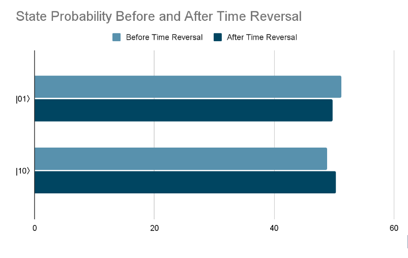

## Project Structure
˫Leaking information from black hole.ipynb
˫Readme.md
˪images/

A conceptual quantum simulation inspired by black hole physics.

Overview:
This project explores whether structured quantum information can exist within what appears to be random Hawking Radiation. Using Qiskit, a pair of qubits is used to simulate:

1.One qubit as Hawking Radiation
2.One qubit as the black hole's interior

We entangle them and apply reversible transformation and noise - then compare measurement outcomes before and after "reversing time" using KL divergence (relative entropy). The goal is to investigate if information can be recovered or traced, simulating how it might behave near a black hole's boundary.

Motivation:
In the 1970s, Stephen Hawking proposed that black holes emit thermal radiation, which seemed to destroy information - violating quantum theory. However, later developments like the Holographic principle, Ads/CFT, and Hawking's revised 2014 stance suggests that radiation may only appear random - and that information could be preserved, just highly scrambled.

This simulation is a conceptual step toward testing that idea on a quantum computer.

Approach:
1.Create a Bell state to simulate entanglement between interior and radiation.
2.Introduce quantum noise to mimic decoherence.
3.Apply reversible operations (X and Z gates) to simulate "time reversal".
4.Use KL divergence to compare probability distributions before and after.
5.Visualize using Qiskit tools.

What's Inside:
1.Leaking_information_from_black_hole.ipynb: Full simulation code in Qiskit'
2.Qubit circuit diagram + histogram visualization.
3.Relative entropy calculation to analyze reversibility and information preservation.

Disclaimer:
This is a conceptual simulation, not a physical model of black hole radiation. It is meant to explore ideas related to information flow, quantum enatanglement, and scrambling, inspired by the black hole information paradox.

## License
This project is shared for educational and conceptual purposes. Not for commercial use.